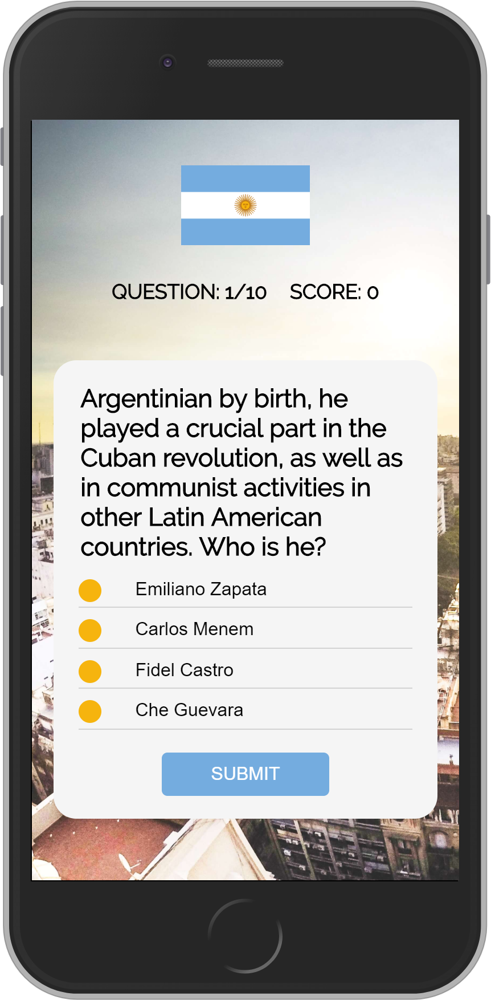

# Argentina Quiz App README
Simple quiz app about Argentina.

## Requirements

1. Create a responsive quiz app

2. User should be prompted through 10 multiple choice questions. User should not be able to skip questions.

3. App needs to track what question the user is on, and their score.

4. Upon submitting an answer, user should receive textual feedback about their answer (wrong or right) and be able to move on to the next question.

5. At the end of the quiz, user should be shown their overall score and be given the chance to start a new quiz.

    

        
         
    

    

         
    

## Built With

- HTML
- CSS
- Javascript
- JQuery

## Acknowledgements

* Buenos Aires image: Photo by Andrea Leopardi on Unsplash 
* Tierra del Fuego image: Photo by Loïc Mermilliod on Unsplash
* Yerba Mate Image: Argentina Travel Blog sayhueque.com
